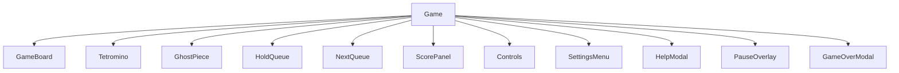
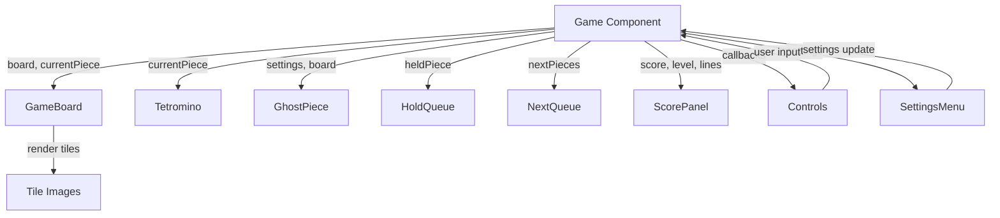

# Tetris Game Architecture Plan

## Overview
This plan outlines the architecture for a fully functional Tetris game built in Next.js with TypeScript. The game will be contained within a single non-scrollable screen, responsive across mobile, tablet, and desktop devices. It incorporates standard Tetris mechanics, custom PNG tiles with dynamic skin selection, scoring with localStorage persistence, configurable settings, keyboard and touch controls, modern UI with animations, React hooks for state management, performance optimizations, and enhancements like pause/resume, restart, help modal, and optional sounds.

## Component Architecture
The application follows a component-based structure with the following key components:

- **Game**: Main container component that orchestrates the game state and renders all sub-components.
- **GameBoard**: Renders the 10x20 (configurable) grid, displaying placed pieces and the current falling tetromino.
- **Tetromino**: Represents the falling piece, rendered as a collection of tiles.
- **GhostPiece**: Optional preview of where the piece will land.
- **HoldQueue**: Displays the held piece.
- **NextQueue**: Shows upcoming pieces.
- **ScorePanel**: Displays score, level, lines cleared, and high score.
- **Controls**: On-screen buttons for mobile/touch controls.
- **SettingsMenu**: Modal for configuring game settings (speed, board size, ghost pieces, etc.).
- **HelpModal**: Instructions and controls guide.
- **PauseOverlay**: Overlay for pause/resume functionality.
- **GameOverModal**: Displays final score and restart option.

### Component Hierarchy Diagram


## State Management
State is managed using React hooks within the Game component:

- **useState** for:
  - board: 2D array representing the game grid
  - currentPiece: Current falling tetromino (position, shape, rotation)
  - nextPieces: Queue of upcoming pieces
  - heldPiece: Currently held piece
  - score: Current score
  - level: Current level
  - linesCleared: Total lines cleared
  - gameState: 'playing', 'paused', 'gameOver'
  - settings: Object containing configurable options

- **useEffect** for:
  - Game loop (piece falling, collision detection, line clearing)
  - Keyboard event listeners
  - Touch gesture handlers
  - localStorage persistence for high scores and settings

- **useCallback** for event handlers to prevent unnecessary re-renders

- **useMemo** for computed values like ghost piece position

## File Organization
```
app/
├── components/
│   ├── Game.tsx
│   ├── GameBoard.tsx
│   ├── Tetromino.tsx
│   ├── GhostPiece.tsx
│   ├── HoldQueue.tsx
│   ├── NextQueue.tsx
│   ├── ScorePanel.tsx
│   ├── Controls.tsx
│   ├── SettingsMenu.tsx
│   ├── HelpModal.tsx
│   ├── PauseOverlay.tsx
│   └── GameOverModal.tsx
├── hooks/
│   ├── useGameState.ts
│   ├── useKeyboardControls.ts
│   ├── useTouchControls.ts
│   └── useLocalStorage.ts
├── types/
│   ├── GameState.ts
│   ├── TetrominoType.ts
│   ├── Settings.ts
│   └── Position.ts
├── utils/
│   ├── gameLogic.ts
│   ├── collisionDetection.ts
│   ├── lineClearing.ts
│   ├── scoring.ts
│   └── tileLoader.ts
├── page.tsx
└── globals.css
```

## Responsive Design
- Use CSS Grid for the game board layout
- Flexbox for overall component arrangement
- Tailwind CSS classes with responsive breakpoints
- Media queries for portrait/landscape orientations
- Touch-friendly button sizes on mobile
- Scalable board size based on screen dimensions

## Tile System
- Tiles stored in `/public/tiles/` as PNG files
- Dynamic skin selection via settings
- Skins organized as sets of 7 tiles (one for each tetromino type: I, O, T, S, Z, J, L)
- Tile loading handled by `tileLoader.ts` utility
- Fallback to default skin if selected skin is unavailable

## Controls
- **Keyboard**: WASD or arrow keys for movement/rotation, space for hard drop, C for hold, P for pause
- **Touch**: Swipe gestures for movement, tap for rotation, on-screen buttons for other actions
- Event listeners attached via useEffect in custom hooks
- Debouncing for rapid key presses

## Performance Optimization
- React.memo for static components
- useMemo for expensive computations (e.g., ghost piece calculation)
- Efficient board updates using immutable data structures
- Throttled game loop using requestAnimationFrame
- Lazy loading for modals and non-critical components

## Integration and Data Flow
Data flows from the Game component down to child components via props. State updates are handled by callback functions passed as props.

### Data Flow Diagram


## Game Loop Pseudocode
```typescript
useEffect(() => {
  if (gameState !== 'playing') return;

  const gameLoop = () => {
    // Move piece down
    const newPiece = movePieceDown(currentPiece);
    
    if (checkCollision(board, newPiece)) {
      // Place piece on board
      const newBoard = placePiece(board, currentPiece);
      const { clearedBoard, linesCleared } = clearLines(newBoard);
      
      // Update score and level
      const newScore = calculateScore(score, linesCleared, level);
      const newLevel = calculateLevel(linesCleared);
      
      // Generate next piece
      const nextPiece = nextPieces[0];
      const newNextPieces = [...nextPieces.slice(1), generateRandomPiece()];
      
      // Check game over
      if (checkGameOver(clearedBoard, nextPiece)) {
        setGameState('gameOver');
      } else {
        setBoard(clearedBoard);
        setCurrentPiece(nextPiece);
        setNextPieces(newNextPieces);
        setScore(newScore);
        setLevel(newLevel);
        setLinesCleared(prev => prev + linesCleared);
      }
    } else {
      setCurrentPiece(newPiece);
    }
  };

  const interval = setInterval(gameLoop, getDropSpeed(level));
  return () => clearInterval(interval);
}, [gameState, currentPiece, board, nextPieces, score, level]);
```

## Additional Features
- **Animations**: CSS transitions for piece movement, line clearing effects
- **Sounds**: Optional audio effects using Web Audio API or HTML5 audio
- **Accessibility**: Keyboard navigation, screen reader support
- **Error Handling**: Graceful fallbacks for missing assets or browser incompatibilities

This architecture provides a solid foundation for implementing a feature-rich Tetris game with good performance and maintainability.